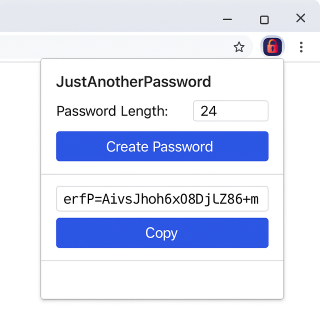

# JustAnotherPassword

**JustAnotherPassword** is a lightweight and privacy-focused Chrome extension that generates secure random passwords locally in your browser using browser-native cryptographic randomness.



## Features

- Secure password generation using the browser's cryptography API
- Broad character set for more varied password output
- Scroll to select password lengths from 4 to 252 characters
- No text fields or dropdowns — just click and scroll
- Password is shown in a second popup with a copy-to-clipboard button
- Temporary local storage is used only to pass the generated password between extension windows
- Storage clears automatically after a short timeout or when the user closes the password window with the extension's close button
- No tracking, no telemetry, no accounts, and no server-side processing
- Works locally in the browser

## How It Works

1. Click the extension icon to open the generator popup.
2. The default password length is 24 characters.
3. Hover over the character length text to use the mouse scroll wheel over the length display to select a different password length.
4. Click the generate button to create a new password.
5. A second popup displays the generated password.
6. Click the copy button to copy the password to the clipboard.
7. The temporary password value is cleared from Chrome local storage after the timeout or when the password window is closed **using the extension's close button**.

Passwords are generated directly from a broad password alphabet using cryptographically secure random values from the browser. The extension does not use server-side generation, network calls, accounts, telemetry, or remote storage.

## Installation

You can install the extension via the Chrome Web Store once published, or manually:

1. Clone this repo or download the ZIP from the releases page.
2. Visit `chrome://extensions/` in Chrome.
3. Enable **Developer Mode**.
4. Click **Load unpacked**.
5. Select the `JustAnotherPassword` extension folder.

### Release Verification

Each release package can be verified with the SHA-256 hash below. Match the ZIP package hash from the Chrome Web Store with the GitHub release download.

### Current Release Hash

```text
Version: 3.1.0
File: JustAnotherPassword.zip
SHA-256: CD16DBA2CC6E816D2275D30DA73212FCC47776C3807E4BE60B1573F5C43578E4

## Privacy

JustAnotherPassword does not collect, sell, share, or transmit personal data. All password generation occurs locally in your browser.

The extension temporarily uses Chrome local storage only to pass the generated password from the generator popup to the password display window. Clipboard write access is used only when the user copies a password or when the extension attempts to overwrite the clipboard after the temporary password period expires.

View the [Privacy Policy](https://garrettds11.github.io/JustAnotherPassword/privacy.html).

## Project Structure

```text
JustAnotherPassword/
├── manifest.json
├── popup.html
├── popup.js
├── password.html
├── password.js
├── style.css
├── icon16.png
├── icon32.png
├── icon48.png
├── icon128.png
├── key.svg
├── clip.svg
├── x.svg
├── JustAnotherPassword.png
├── privacy.html
└── store-listing.txt

```

## 💡 Credits

Inspired by the brilliant [CyberChef](https://gchq.github.io/CyberChef/) tool for data transformations.

## 🛠️ License

MIT License — see [LICENSE](LICENSE) for details.

```

