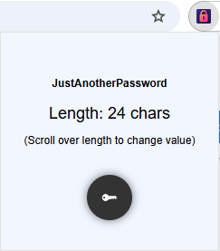

# JustAnotherPassword

**JustAnotherPassword** is a lightweight and privacy-focused Chrome extension that generates secure, pseudo-random passwords using CyberChef-style logic and a custom base64 alphabet.

 

## Features

- Secure passwords generated using random bytes → hex → base64
- Custom base64 alphabet (Hazz15) for obfuscated yet readable results
- Scroll to select password lengths (from 4 to 252 characters)
- No text fields or dropdowns — just click and scroll
- Password is shown in a second popup with a copy-to-clipboard button
- No external network requests — **fully offline**
- No tracking, no storage, no data collection

## How It Works

1. On icon click, a popup opens with a default 24-character length.
2. Use your mouse scroll wheel to cycle through available password lengths.
3. Click **"Create Password"** to generate a new password.
4. A second popup displays the password with a **"Copy"** button.


Passwords are derived from cryptographically secure random bytes.
These bytes are first converted to a hex string, then base64-encoded using a custom alphabet.

```

HNO4klm6ij9n+J2hyf0gzA8uvwDEq3X1Q7ZKeFrWcVTts/MRGYbdxSo=ILaUpPBC5

```

This process enhances readability while preserving full entropy from the original data.

## Installation

You can install the extension via the [Chrome Web Store](#) once published, or manually:

1. Clone this repo or [download the ZIP](https://github.com/garrettds11/justanotherpassword/releases).
2. Visit `chrome://extensions/` in your browser.
3. Enable **Developer Mode**.
4. Click **Load unpacked** and select the extracted folder.

## Privacy

JustAnotherPassword does not collect or transmit any user data. All operations are performed locally in your browser.  
View the [Privacy Policy](https://garrettds11.github.io/justanotherpassword/privacy.html)

## Project Structure

```

JustAnotherPassword/
├── manifest.json
├── popup.html
├── popup.js
├── password.html
├── style.css
├── icons/ (16, 32, 48, 128 PNGs)
├── privacy.html
└── store-listing.txt

```

## 💡 Credits

Inspired by the brilliant [CyberChef](https://gchq.github.io/CyberChef/) tool for data transformations.

## 🛠️ License

MIT License — see [LICENSE](LICENSE) for details.

```

